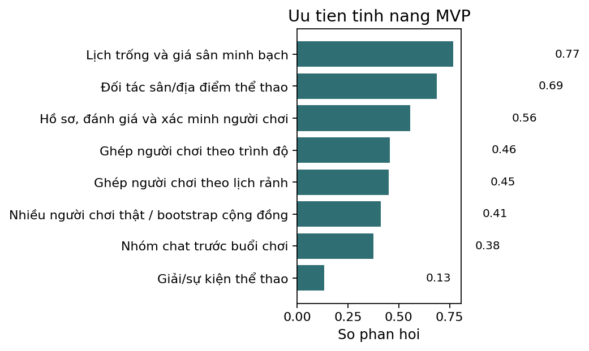

# Báo cáo phân tích khảo sát startup thể thao

## Executive Summary
- Bộ dữ liệu có **159 phản hồi** và **22 cột**. File gốc `response_details.csv` được giữ nguyên; dữ liệu đã làm sạch được lưu tại `data/cleaned_survey.csv`.
- Kết luận chính: **Có tín hiệu demand đủ để tiếp tục MVP hẹp, nhưng chưa đủ để kết luận thị trường TP.HCM rộng lớn đã được xác thực.**
- Lý do ủng hộ demand: **118/159** người từng thiếu người chơi cùng ít nhất thỉnh thoảng; **131/159** cho rằng app có thể hoặc chắc chắn giúp họ chơi thường xuyên hơn; **106/159** cần đặt sân/tìm địa điểm ít nhất thỉnh thoảng.
- Điểm yếu: mẫu lệch mạnh về nhóm 18-22 và học sinh/sinh viên; WTP chắc chắn chỉ **20/159**; chưa có dữ liệu giá cụ thể hoặc thông tin tính toán response rate.

## Dataset Overview
- Kích thước: 159 dòng x 22 cột.
- Thiếu dữ liệu đáng chú ý: câu hỏi thể thao và demand có 10 dòng trống; nhóm đặt sân có 21 dòng trống; câu hỏi mở `open_motivation` rất thưa với 141 dòng trống.
- Bảng hỗ trợ: `reports/tables/data_dictionary.csv`, `reports/tables/missing_values.csv`, `reports/tables/cleaning_log.csv`.

## Key Findings
### Nhân khẩu học
- Tuổi: 18–22: 147 (92.5% toàn mẫu); 23–30: 9 (5.7% toàn mẫu); Dưới 18: 3 (1.9% toàn mẫu).
- Nghề nghiệp: Học sinh/Sinh viên: 140 (88.1% toàn mẫu); Nhân viên văn phòng: 11 (6.9% toàn mẫu); Freelancer: 3 (1.9% toàn mẫu); Người lao động tự do: 3 (1.9% toàn mẫu); Khác: 1 (0.6% toàn mẫu).
- Giới tính: Nam: 89 (56.0% toàn mẫu); Nữ: 66 (41.5% toàn mẫu); Không muốn trả lời: 3 (1.9% toàn mẫu); Khác: 1 (0.6% toàn mẫu).
- Diễn giải: mẫu phù hợp để hiểu nhóm sinh viên/trẻ tại TP.HCM, nhưng không đại diện cho toàn bộ người chơi thể thao hoặc người đi làm.

### Hành vi thể thao
- Mức quan tâm/chơi thể thao: Có, thỉnh thoảng: 51 (32.1% toàn mẫu); Có, thường xuyên: 44 (27.7% toàn mẫu); Trước đây có chơi nhưng hiện tại ít chơi: 44 (27.7% toàn mẫu); Không quan tâm: 10 (6.3% toàn mẫu); Chưa chơi thường xuyên nhưng muốn bắt đầu: 10 (6.3% toàn mẫu).
- Tần suất lý tưởng: 1–2 lần/tuần: 57 (35.8% toàn mẫu); Khi có người rủ: 37 (23.3% toàn mẫu); 3 lần/tuần trở lên: 36 (22.6% toàn mẫu); 1–3 lần/tháng: 14 (8.8% toàn mẫu); Chưa rõ: 5 (3.1% toàn mẫu).
- Môn thể thao nổi bật: Cầu lông: 107 (67.3% toàn mẫu); Bơi lội: 59 (37.1% toàn mẫu); Bóng đá: 54 (34.0% toàn mẫu); Gym/Fitness theo nhóm: 49 (30.8% toàn mẫu); Chạy bộ theo nhóm: 39 (24.5% toàn mẫu); Bóng chuyền: 30 (18.9% toàn mẫu).

### Problem & Solution Fit
- Thiếu người chơi: Thỉnh thoảng: 75 (47.2% toàn mẫu); Rất thường xuyên: 43 (27.0% toàn mẫu); Hiếm khi: 19 (11.9% toàn mẫu); Chưa bao giờ: 12 (7.5% toàn mẫu).

- Pain point tìm người chơi: Bạn bè/người quen không rảnh: 122 (76.7% toàn mẫu); Không đủ số lượng người để chơi: 75 (47.2% toàn mẫu); Khó tìm người cùng lịch rảnh: 69 (43.4% toàn mẫu); Khó tìm người cùng trình độ: 40 (25.2% toàn mẫu); Không biết tìm người chơi ở đâu: 31 (19.5% toàn mẫu); Người chơi hay hủy kèo: 24 (15.1% toàn mẫu).

- Pain point của cách tìm hiện tại: Không biết ai đang rảnh: 107 (67.3% toàn mẫu); Phải nhắn nhiều nơi mới đủ người: 78 (49.1% toàn mẫu); Khó tìm người gần mình: 56 (35.2% toàn mẫu); Ngại chơi với người lạ vì thiếu thông tin: 56 (35.2% toàn mẫu); Dễ bị hủy kèo vào phút cuối: 48 (30.2% toàn mẫu); Không biết trình độ người chơi: 33 (20.8% toàn mẫu).
- Nhu cầu đặt sân/tìm địa điểm: Thỉnh thoảng: 76 (47.8% toàn mẫu); Hiếm khi: 32 (20.1% toàn mẫu); Thường xuyên: 30 (18.9% toàn mẫu); Không bao giờ: 11 (6.9% toàn mẫu).
- Pain point đặt sân/tìm địa điểm: Không biết sân/địa điểm nào còn trống: 86 (54.1% toàn mẫu); Không rõ chất lượng sân/địa điểm: 74 (46.5% toàn mẫu); Không rõ giá: 72 (45.3% toàn mẫu); Phải gọi/nhắn nhiều nơi: 62 (39.0% toàn mẫu); Dễ bị trùng lịch hoặc hết chỗ: 56 (35.2% toàn mẫu); Không có đánh giá từ người chơi trước: 28 (17.6% toàn mẫu).

## Hidden Insights
### 1. Nhu cầu có dấu hiệu thật, nhưng chưa phải nhu cầu trả phí mạnh.
- Evidence: 131/159 kỳ vọng chơi thường xuyên hơn, nhưng chỉ 20/159 trả lời chắc chắn sẵn sàng trả phí.
- Business Meaning: Không nên bắt đầu bằng subscription rộng; cần gắn phí với giao dịch có giá trị rõ như đặt sân hoặc tham gia trận.
- Action: Ưu tiên phí tiện ích/hoa hồng đặt sân và kiểm chứng willingness-to-pay bằng landing page hoặc concierge MVP.
### 2. App chỉ có giá trị nếu đạt mật độ người chơi thật.
- Evidence: 111/159 có WTP có điều kiện hoặc không chắc chắn; switching trigger 'Có nhiều người chơi thật' xuất hiện nổi bật.
- Business Meaning: Rủi ro chicken-and-egg lớn hơn rủi ro tính năng.
- Action: Launch theo cụm nhỏ: một vài trường/khu vực/môn thể thao trước khi mở rộng toàn thành phố.
### 3. Vấn đề tin tưởng là rào cản nền tảng khi ghép người lạ.
- Evidence: Trust-factor table cho thấy hồ sơ, đánh giá, xác minh, trình độ và nhóm chat đều xuất hiện lặp lại.
- Business Meaning: Ghép lịch và trình độ chưa đủ; thiếu trust sẽ làm giảm conversion sang buổi chơi thật.
- Action: MVP phải có hồ sơ cơ bản, review sau buổi chơi, xác minh số điện thoại và chat trước buổi chơi.
### 4. Đặt sân là pain point có thể kiếm tiền hơn cộng đồng thuần túy.
- Evidence: 106/159 cần đặt sân/tìm địa điểm ít nhất thỉnh thoảng; paid-feature table có tín hiệu phí đặt sân/địa điểm tiện lợi cao.
- Business Meaning: Booking tạo giao dịch rõ ràng và dễ justify fee hơn tính năng cộng đồng.
- Action: Ưu tiên dữ liệu sân, lịch trống, giá, đánh giá sân và quy trình đặt/giữ chỗ.
### 5. Mẫu khảo sát rất lệch về sinh viên 18-22.
- Evidence: 147/159 ở nhóm 18-22 và 140/159 là học sinh/sinh viên.
- Business Meaning: Kết quả phù hợp để chọn beachhead segment, không đủ để khẳng định đại diện toàn bộ người chơi thể thao tại TP.HCM.
- Action: Báo cáo demand là promising trong nhóm trẻ/sinh viên; validation tiếp theo cần mẫu người đi làm và người đặt sân thường xuyên.

## Target Segments
- Primary early adopter đề xuất: **18-22 và học sinh/sinh viên đang có pain thiếu người chơi, sẵn sàng gặp người mới, và có kỳ vọng app giúp chơi thường xuyên hơn**.
- Segment early adopter theo rule định lượng có **59/159** người.
- Segment sinh viên 18-22 chiếm **137/159** mẫu; trong bảng segment, nhóm này có WTP bất kỳ **83.2%** và ứng viên early adopter **38.7%**.
- Secondary segment: người có nhu cầu đặt sân/tìm địa điểm thỉnh thoảng hoặc thường xuyên, vì có liên hệ trực tiếp với booking convenience và monetization.

## Main Pain Points
- Tìm người chơi: bạn bè/người quen không rảnh, không đủ số lượng, khó khớp lịch, khó khớp trình độ, thiếu thông tin/uy tín khi gặp người lạ.
- Đặt sân/tìm địa điểm: không biết lịch trống, phải gọi/nhắn nhiều nơi, không rõ giá, không rõ chất lượng sân, dễ hết chỗ/trùng lịch.
- Ý nghĩa: app nên giải quyết coordination + trust + booking transparency trước khi mở rộng sang social/community features.

## Alternatives
- Cách tìm người hiện tại: Rủ bạn bè/người quen trực tiếp: 126 (79.2% toàn mẫu); Nhóm Zalo/Messenger: 72 (45.3% toàn mẫu); Nhóm Facebook: 43 (27.0% toàn mẫu); Cộng đồng trường học/công ty: 40 (25.2% toàn mẫu); Không chủ động tìm: 30 (18.9% toàn mẫu); chỉ chơi khi có người rủ: 30 (18.9% toàn mẫu).
- Cách đặt sân hiện tại: Nhắn Zalo/Facebook cho sân: 90 (56.6% toàn mẫu); Gọi điện trực tiếp cho sân: 77 (48.4% toàn mẫu); Nhờ bạn bè đặt: 68 (42.8% toàn mẫu); Đặt qua app/website: 45 (28.3% toàn mẫu); Đến trực tiếp sân: 40 (25.2% toàn mẫu); Hỏi trong nhóm cộng đồng: 13 (8.2% toàn mẫu).
- Diễn giải: người dùng đang dùng giải pháp thủ công và phân mảnh, chủ yếu qua bạn bè, nhóm chat, Facebook/Zalo, gọi điện hoặc nhờ người khác đặt.

## MVP Feature Table
| Feature | Priority | Score | Evidence |
|---|---:|---:|---|
| Lịch trống và giá sân minh bạch | Must-have | 0.768 | booking_pains + switching_triggers + paid_features |
| Đối tác sân/địa điểm thể thao | Must-have | 0.687 | switching_triggers + booking methods/pains |
| Hồ sơ, đánh giá và xác minh người chơi | Nice-to-have | 0.556 | trust_factors + switching_triggers + current finding pains |
| Ghép người chơi theo trình độ | Nice-to-have | 0.455 | switching_triggers + trust factors + teammate pain |
| Ghép người chơi theo lịch rảnh | Nice-to-have | 0.451 | switching_triggers + teammate pain |
| Nhiều người chơi thật / bootstrap cộng đồng | Nice-to-have | 0.412 | switching_triggers + WTP conditional on user density |
| Nhóm chat trước buổi chơi | Nice-to-have | 0.375 | trust_factors |
| Giải/sự kiện thể thao | Ignore/Defer | 0.134 | paid_features |

## Monetization Signal
- WTP: Có thể, nếu giá hợp lý: 79 (49.7% toàn mẫu); Có thể, nếu app thật sự có nhiều người dùng: 32 (20.1% toàn mẫu); Có: 20 (12.6% toàn mẫu); Không: 18 (11.3% toàn mẫu).

- Tính năng trả phí: Phí đặt sân/địa điểm tiện lợi: 100 (62.9% toàn mẫu); Phí tham gia trận/nhóm chơi: 53 (33.3% toàn mẫu); Phí tham gia giải hoặc sự kiện thể thao: 37 (23.3% toàn mẫu); Gói premium để được ghép người phù hợp hơn: 36 (22.6% toàn mẫu); quản lý clb hoặc nhóm người hoạt động thường xuyên: 1 (0.6% toàn mẫu); Cho biết trước việc sân còn hay hết chỗ: 1 (0.6% toàn mẫu).
- Khuyến nghị business model: bắt đầu bằng **phí đặt sân/địa điểm tiện lợi hoặc hoa hồng đặt sân**, sau đó thử phí tham gia trận/nhóm chơi. Không nên mở đầu bằng subscription premium rộng vì WTP chắc chắn còn thấp và phụ thuộc mật độ người dùng.

## Go-To-Market
- Launch theo cụm nhỏ: 1-2 trường đại học hoặc khu dân cư có sân cầu lông/bóng đá/bóng chuyền gần nhau.
- Chọn một hoặc hai môn có nhu cầu lặp lại cao để tạo liquidity trước.
- Kết hợp cộng đồng sinh viên, nhóm Zalo/Messenger hiện hữu, và đối tác sân để kéo cả hai phía marketplace.

## Risks / Weak Signals
- Mẫu không đại diện: nhóm 18-22 và học sinh/sinh viên áp đảo.
- WTP chắc chắn thấp: chỉ 20/159 trả lời "Có".
- Không có câu hỏi giá cụ thể nên chưa định lượng được price sensitivity.
- Không có dữ liệu hành vi thật như click, booking, attendance, retention.
- Hạn chế phương pháp: Thiếu thông tin tổng thể để tính toán response rate; khảo sát trực tuyến tự nguyện làm tăng rủi ro lệch mẫu.

## Next Validation Steps
- Concierge MVP: tạo nhóm ghép trận thủ công theo một môn/khu vực trong 2-4 tuần.
- Landing page test: đo conversion đăng ký, chọn môn, chọn lịch, sẵn sàng đặt cọc.
- Booking pilot: hợp tác vài sân để test lịch trống, giá, và phí tiện ích.
- WTP test: thử mức phí cụ thể thay vì chỉ hỏi ý định trả phí chung.
- Survey bổ sung: lấy mẫu người đi làm, người đặt sân thường xuyên, chủ sân, và nhóm tuổi ngoài sinh viên.

## Final Decision
**Có tín hiệu demand đủ để tiếp tục MVP hẹp, nhưng chưa đủ để kết luận thị trường TP.HCM rộng lớn đã được xác thực.** Nên tiếp tục MVP, nhưng phạm vi nên hẹp: teammate matching + trust + court availability/price cho một nhóm early adopter cụ thể. Chưa nên tuyên bố product-market fit hoặc demand đại diện toàn TP.HCM.
