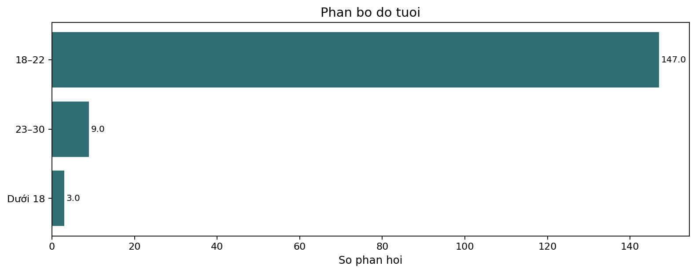
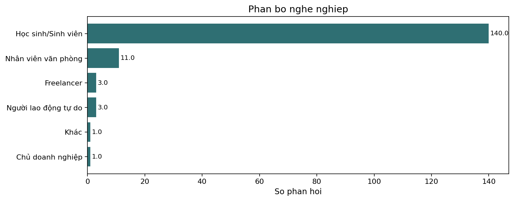
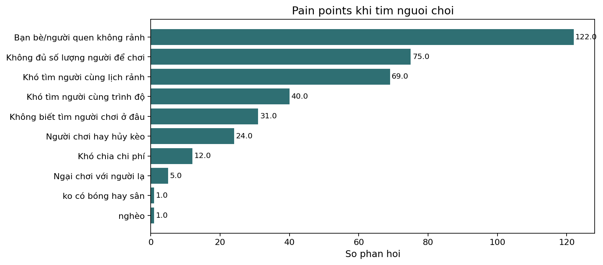
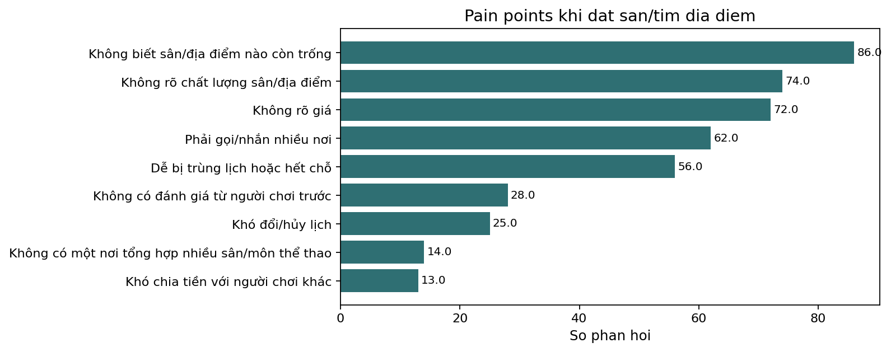
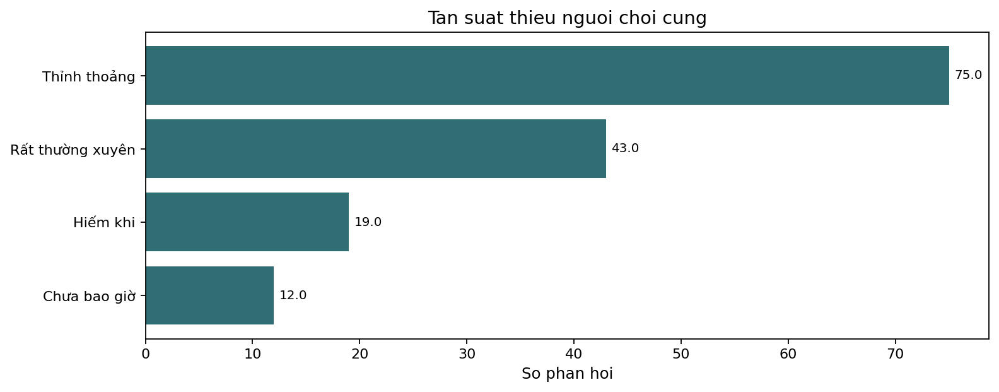
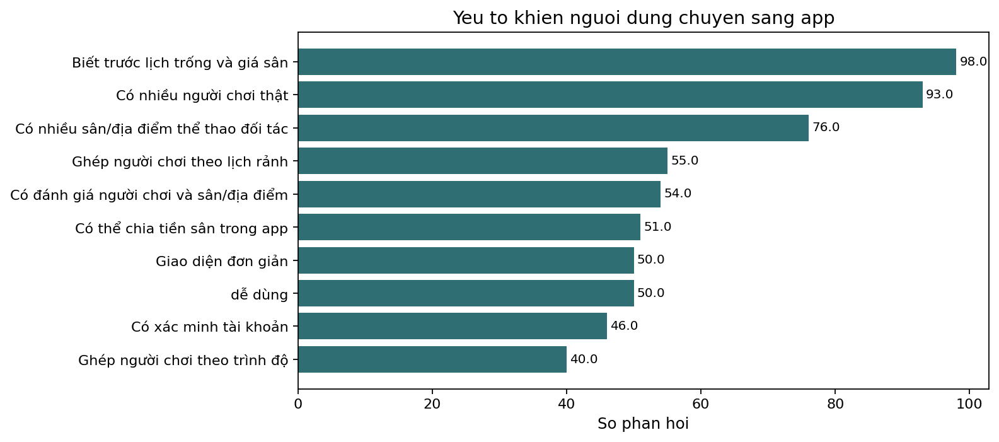
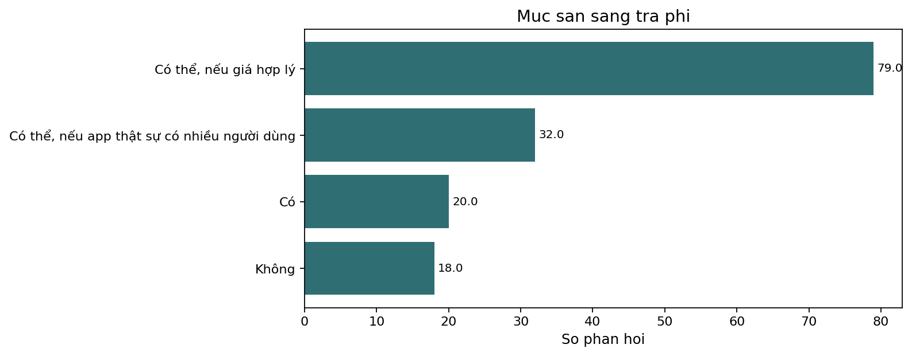

# Báo cáo phương pháp khảo sát và tuân thủ

## 5.2.1 Objective & Target Audience
### 5.2.1.1 Mục tiêu khảo sát
Mục tiêu là đánh giá nhu cầu với ứng dụng tìm bạn chơi thể thao, ghép người theo khu vực/trình độ/lịch rảnh, hỗ trợ đặt sân hoặc tìm địa điểm, và kiểm tra tín hiệu sẵn sàng trả phí.

Các giả thuyết phân tích:
- H1: Tồn tại nhu cầu đối với việc tìm bạn chơi thể thao và đặt sân/địa điểm tiện lợi. Được ủng hộ, nhưng mẫu lệch nhiều về sinh viên và không mang tính đại diện toàn bộ.
- H2: Nhóm học sinh/sinh viên trẻ tuổi là phân khúc người dùng sớm (early adopter) triển vọng nhất. Được ủng hộ như một phân khúc thực tế để launch (beachhead segment), không phải bằng chứng cho toàn bộ thị trường TP.HCM.
- H3: Các cơ chế xây dựng lòng tin là yêu cầu bắt buộc để người dùng chấp nhận chơi với người lạ. Được ủng hộ; việc ghép trận mà không có cơ chế tin cậy sẽ không giải quyết được rào cản hành vi.
- H4: Tiện ích đặt sân và tìm địa điểm là wedge (bước đệm) monetization (tạo doanh thu) mạnh nhất. Được ủng hộ về mặt định hướng; mức giá cụ thể chưa thể ước lượng vì bảng khảo sát không hỏi các mức giá.
- H5: Các giải pháp thay thế hiện tại (Facebook, Zalo, bạn bè) quá phân mảnh và gây bất tiện. Được ủng hộ; cơ hội mở ra nếu sản phẩm giải quyết được vấn đề kết nối cung-cầu (liquidity) và đối tác sân.
- H6: Khảo sát ý tưởng (validation) hiện tại vẫn chưa hoàn tất do các hạn chế về phương pháp và tín hiệu WTP. Được ủng hộ; các bước validation tiếp theo cần đo lường tỷ lệ chuyển đổi đặt sân thực tế và kiểm chứng mức giá.

### 5.2.1.2 Target audience và sample
- Target audience suy luận: người đang chơi, từng chơi, hoặc muốn bắt đầu chơi thể thao tại TP.HCM, đặc biệt nhóm cần tìm người chơi cùng hoặc cần đặt sân.
- Sample thực tế trong CSV: 159 phản hồi.
- Mẫu bị lệch: 147/159 ở độ tuổi 18-22; 140/159 là học sinh/sinh viên.
- Kết luận tuân thủ: có thể dùng để phân tích nhóm trẻ/sinh viên, nhưng không đủ căn cứ để đại diện cho toàn bộ thị trường TP.HCM.

## 5.2.2 Survey Method
- Phương pháp khảo sát: Khảo sát trực tuyến (online survey) được thực hiện thông qua công cụ Google Forms.
- Phù hợp mục tiêu: Google Forms phù hợp với đối tượng mục tiêu trẻ tuổi (học sinh/sinh viên), giúp tối ưu hóa chi phí và nguồn lực hạn chế của startup trong giai đoạn khảo sát ý tưởng. Tuy nhiên, phương thức phân phối online qua mạng xã hội và nhóm chat dẫn đến rủi ro mẫu thuận tiện (convenience sampling), làm tăng độ lệch của mẫu nhân khẩu học.

## 5.2.3 Questionnaire Design
- Số câu hỏi phân tích: 21 câu nội dung cộng UID định danh kỹ thuật.
- Loại câu hỏi có trong khảo sát: single choice, multiple choice, Likert/ordinal scale, và open-ended response.
- Ví dụ single choice: tuổi, giới tính, nghề nghiệp, thu nhập, mức quan tâm thể thao, tần suất lý tưởng, WTP.
- Ví dụ multiple choice: môn thể thao, pain points, trust factors, cách tìm người, cách đặt sân, switching triggers, paid features.
- Ví dụ Likert/ordinal: mức sẵn sàng chơi với người mới từ 1 đến 5.
- Ví dụ open-ended: điều gì khiến respondent quan tâm hơn đến việc chơi thể thao.
- Đánh giá bias: câu hỏi số 18 và 19 mô tả app theo hướng có lợi nên có thể tạo hypothetical bias; báo cáo business không được xem các câu này là bằng chứng hành vi thật.

## 5.2.4 Recruitment
- Phương thức tuyển mẫu: Người trả lời được tiếp cận trực tuyến thông qua việc chia sẻ liên kết khảo sát Google Forms trên các kênh mạng xã hội, hội nhóm thể thao và cộng đồng sinh viên.
- Tuân thủ pháp lý & Contact Sourcing: Khảo sát thu thập dữ liệu bằng cách để người tham gia tự nguyện nhấp vào liên kết và điền thông tin trực tiếp, không sử dụng danh sách liên hệ từ bên thứ ba (no third-party contact list was used), đảm bảo tuân thủ các quy định về quyền riêng tư và điều khoản sử dụng của nền tảng.

## 5.2.5 Incentives and Compensation
- Chính sách bồi thường/khuyến khích: Khảo sát hoàn toàn không sử dụng bất kỳ phần thưởng, quà tặng hay lợi ích tài chính nào để khuyến khích người tham gia trả lời (no incentives).
- Tác động đến dữ liệu: Việc không cung cấp incentive giúp loại bỏ hoàn toàn rủi ro sai lệch do phần thưởng (response bias / incentive bias) - nơi người dùng trả lời giả tạo hoặc hời hợt chỉ để nhận quà. Toàn bộ phản hồi phản ánh động lực và mối quan tâm thực sự của đối tượng tham gia.

## 5.2.6 Anonymity
- Bảo vệ danh tính: Danh tính cá nhân của người tham gia khảo sát được bảo mật và ẩn danh hoàn toàn (personal identity is hidden). Tên của người tham gia không được thu thập.
- Thu thập và xử lý email (Yêu cầu 5.2.6.2): Để tuân thủ yêu cầu môn học về việc thu thập email nhưng vẫn bảo mật danh tính, địa chỉ email của người phản hồi được thu thập thông qua Google Forms nhưng được tách riêng biệt ngay từ đầu. Dữ liệu phân tích trong `response_details.csv` chỉ chứa mã định danh duy nhất `UID` đã được ẩn danh hóa. File lưu trữ địa chỉ email (PII) được cất giữ ở một vị trí bảo mật khác và chỉ được liên kết nội bộ khi cần thiết, đảm bảo không có bất kỳ thông tin nhận dạng cá nhân nào bị lộ trong các báo cáo và phân tích công khai.

## 5.2.7 Tools
- Công cụ thu thập dữ liệu: Google Forms.
- Công cụ phân tích và trực quan hóa dữ liệu: Python, Jupyter Notebook, thư viện pandas, numpy và matplotlib.
- Notebook thực thi chính: `survey_analysis.ipynb`.

## 5.2.8 Data Retention
- Chính sách lưu trữ dữ liệu: Dữ liệu ẩn danh (gắn với `UID`) được lưu trữ để phục vụ cho phân tích và cải tiến sản phẩm. Đối với file thông tin nhận dạng cá nhân (PII) chứa địa chỉ email, dữ liệu này được lưu trữ riêng biệt tại một thư mục an toàn và sẽ được xóa bỏ/hủy hoàn toàn sau thời hạn nghiên cứu là 6 tháng. Báo cáo công khai chỉ sử dụng bộ dữ liệu đã ẩn danh hóa.

## 5.2.9 Informed Consent
- Tự nguyện tham gia: Khảo sát được thực hiện trên tinh thần hoàn toàn tự nguyện, không có bất kỳ hình thức ép buộc hay ràng buộc nào đối với người trả lời.
- Cơ chế chấp thuận (Consent): Form khảo sát được thiết kế với phần giới thiệu rõ ràng về mục đích nghiên cứu. Người tham gia tự nguyện hoàn thành và gửi biểu mẫu Google Forms, hành động này được coi là sự đồng ý (implied consent) cho phép nhóm sử dụng dữ liệu phản hồi đã ẩn danh hóa phục vụ mục đích nghiên cứu môn học và phát triển sản phẩm. Cam kết thông tin cá nhân (email) không bị công bố công khai và sẽ được xóa sạch sau 6 tháng.

## 5.2.10 Sampling, Response Rate and Selection
- Response rate: không tính được vì không có số người được mời.
- Representativeness: không thể tuyên bố đại diện thị trường rộng vì mẫu lệch sinh viên/18-22 và recruitment database không được chứng minh.
- Cách diễn giải đúng: kết quả phản ánh sample hiện tại, hữu ích cho giả thuyết early adopter, không phải market sizing toàn TP.HCM.

## 5.2.11 Analysis
- Closed questions được dùng để tính count, percentage, segment comparison và hypothesis evidence.
- Single-value statistics không đứng một mình; báo cáo luôn so sánh theo giả thuyết hoặc segment.
- Ví dụ: WTP không chỉ nêu tỷ lệ “Có”, mà so với conditional WTP, pain frequency, booking need và paid feature preference.
- Bảng hỗ trợ: `question_summaries.csv`, `segment_comparison.csv`, `hypotheses.csv`, `feature_priority.csv`, `wtp_summary.csv`.

## 5.2.12 Conclusions Based on Survey Result
### Demographic conclusion
Respondents chủ yếu là 18-22 và học sinh/sinh viên. Điều này giúp chọn beachhead segment trong nhóm trẻ, nhưng giới hạn khả năng suy rộng sang người đi làm hoặc toàn bộ thị trường thể thao TP.HCM.

### Customer problems
Khách hàng gặp vấn đề trong tìm người chơi cùng, khớp lịch/trình độ, thiếu thông tin tin cậy khi chơi với người lạ, và đặt sân thủ công. Bằng chứng: `pain_points.csv`, `current_finding_pains.csv`, `booking_pains.csv`.

### Customer interest
Có interest vì 131/159 cho rằng app có thể hoặc chắc chắn giúp họ chơi thường xuyên hơn, và 96/159 sẵn sàng chơi với người mới ở mức 4-5. Tuy nhiên đây là stated interest, chưa phải hành vi thật.

### Willingness to pay
WTP có tín hiệu nhưng chưa mạnh: 131/159 có tín hiệu trả phí nếu tính cả câu trả lời có điều kiện, nhưng chỉ 20/159 trả lời chắc chắn “Có”. Nên ưu tiên phí gắn với giao dịch rõ ràng như đặt sân/địa điểm hoặc tham gia trận.

### Other relevant conclusion
Cần validation tiếp theo bằng MVP hẹp, đo conversion thực tế, booking thực tế, retention, và price test. Survey hiện tại đủ để tạo hypothesis và MVP direction, chưa đủ để chứng minh product-market fit.
